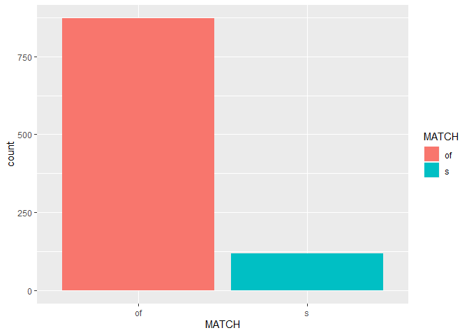
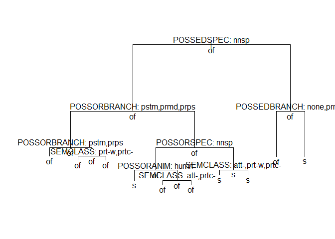
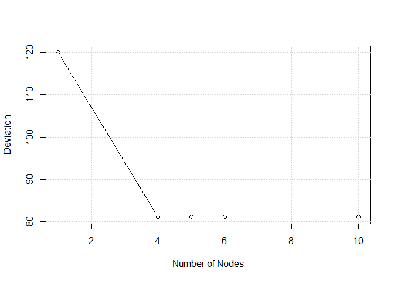
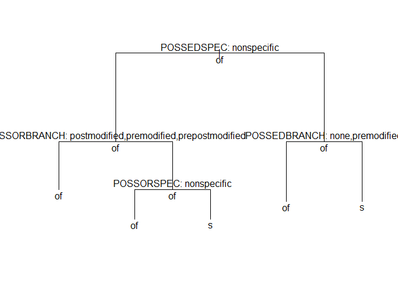

## Introduction

We will explore **<genitivealternation_learners.csv>** to see if we can predict which genitive marker learners use by exploring a few predictors and their interaction.  We will explore using a classification tree model.

### Imports & Initial Data Check


```r
#imports
library("tidyverse"); library("car"); library("effects"); library("tree"); library("knitr")

x <- read.delim("genitivealternation_learners.csv")

#Remove variables we will not be considering
x$LENGTHNP1 <- NULL
x$LENGTHNP2 <- NULL
attach(x)
```

After loading the appropriate libraries & data we look at the first and last five rows.


```r
kable(head(x), caption = "First Five Rows")
```


Table: First Five Rows

MATCH   SEMCLASS         POSSORANIM   POSSEDANIM   POSSORSPEC    POSSEDSPEC    POSSORBRANCH      POSSEDBRANCH   POSSORCOMPL    POSSEDCOMPL 
------  ---------------  -----------  -----------  ------------  ------------  ----------------  -------------  -------------  ------------
of      particip-event   inanimate    inanimate    specific      specific      premodified       none           intermediate   simple      
of      possession       human        inanimate    nonspecific   specific      none              none           simple         simple      
of      attr-holder      inanimate    inanimate    nonspecific   specific      prepostmodified   none           intermediate   simple      
of      attr-holder      inanimate    inanimate    nonspecific   specific      none              none           simple         simple      
of      attr-holder      inanimate    inanimate    nonspecific   nonspecific   postmodified      none           intermediate   simple      
of      attr-holder      human        inanimate    nonspecific   nonspecific   none              none           simple         simple      

```r
kable(head(x), caption = "Last Five Rows")
```


Table: Last Five Rows

MATCH   SEMCLASS         POSSORANIM   POSSEDANIM   POSSORSPEC    POSSEDSPEC    POSSORBRANCH      POSSEDBRANCH   POSSORCOMPL    POSSEDCOMPL 
------  ---------------  -----------  -----------  ------------  ------------  ----------------  -------------  -------------  ------------
of      particip-event   inanimate    inanimate    specific      specific      premodified       none           intermediate   simple      
of      possession       human        inanimate    nonspecific   specific      none              none           simple         simple      
of      attr-holder      inanimate    inanimate    nonspecific   specific      prepostmodified   none           intermediate   simple      
of      attr-holder      inanimate    inanimate    nonspecific   specific      none              none           simple         simple      
of      attr-holder      inanimate    inanimate    nonspecific   nonspecific   postmodified      none           intermediate   simple      
of      attr-holder      human        inanimate    nonspecific   nonspecific   none              none           simple         simple      

```r
kable(summary(x), caption = "Summary")
```


Table: Summary

     MATCH              SEMCLASS       POSSORANIM       POSSEDANIM         POSSORSPEC         POSSEDSPEC            POSSORBRANCH            POSSEDBRANCH         POSSORCOMPL         POSSEDCOMPL 
---  -------  -------------------  ---------------  ---------------  -----------------  -----------------  ----------------------  ----------------------  ------------------  ------------------
     of:872   attr-holder   :435   animate  :  2    human    : 27    nonspecific:626    nonspecific:371    none           :492     none           :736     complex     :  6    complex     :  2  
     s :118   part-whole    : 49   human    :281    inanimate:963    specific   :364    specific   :619    postmodified   :201     postmodified   : 23     intermediate:492    intermediate:246  
              particip-event:250   inanimate:707                                                           premodified    :276     premodified    :224     simple      :492    simple      :742  
              possession    :251                                                                           prepostmodified: 21     prepostmodified:  7                                           
              subcat-cat    :  5                                                                                                                                                                 

Immediately looking at the summary, we can see an imbalance between the observations. Some categorical predictors are poorly represented in the data such as possessor animacy (POSSORANIM), where the category *animate* is only found twice in the data set.


```r
ggplot(data = x, aes(x = MATCH, fill = MATCH)) +
geom_bar()
```

<!-- -->

```r
prop.table(table(x$MATCH))
```

```
## 
##        of         s 
## 0.8808081 0.1191919
```
We can see that observations of the genitive "of" outnumber 's' practically 9 to 1.  With this being said, a basic model of just picking 'of' for every example would give our model an accuracy of 88% from the beginning.  This implies that 88% is not an acceptable model to really explain what is happening.


```r
prop.table(table(x$MATCH))
```

```
## 
##        of         s 
## 0.8808081 0.1191919
```


```r
tree.1 <- tree(MATCH ~ SEMCLASS + POSSORANIM + POSSEDANIM + POSSORSPEC + POSSEDSPEC + POSSORBRANCH + POSSEDBRANCH + POSSORCOMPL + POSSEDCOMPL)


summary(tree.1)
```

```
## 
## Classification tree:
## tree(formula = MATCH ~ SEMCLASS + POSSORANIM + POSSEDANIM + POSSORSPEC + 
##     POSSEDSPEC + POSSORBRANCH + POSSEDBRANCH + POSSORCOMPL + 
##     POSSEDCOMPL)
## Variables actually used in tree construction:
## [1] "POSSEDSPEC"   "POSSORBRANCH" "SEMCLASS"     "POSSORSPEC"  
## [5] "POSSORANIM"   "POSSEDBRANCH"
## Number of terminal nodes:  10 
## Residual mean deviance:  0.2564 = 251.3 / 980 
## Misclassification error rate: 0.06566 = 65 / 990
```
It seems that all predictors are relevant except POSSEDANIM, POSSORCOMPL, and POSSEDCOMPL.

Next we look at the effects numerically.


```r
tree.1
```

```
## node), split, n, deviance, yval, (yprob)
##       * denotes terminal node
## 
##  1) root 990 723.300 of ( 0.88081 0.11919 )  
##    2) POSSEDSPEC: nonspecific 371 442.100 of ( 0.71698 0.28302 )  
##      4) POSSORBRANCH: postmodified,premodified,prepostmodified 171  81.640 of ( 0.93567 0.06433 )  
##        8) POSSORBRANCH: postmodified,prepostmodified 100   0.000 of ( 1.00000 0.00000 ) *
##        9) POSSORBRANCH: premodified 71  61.230 of ( 0.84507 0.15493 )  
##         18) SEMCLASS: part-whole,particip-event 22   0.000 of ( 1.00000 0.00000 ) *
##         19) SEMCLASS: attr-holder,possession 49  52.190 of ( 0.77551 0.22449 ) *
##      5) POSSORBRANCH: none 200 276.500 of ( 0.53000 0.47000 )  
##       10) POSSORSPEC: nonspecific 102 108.900 of ( 0.77451 0.22549 )  
##         20) POSSORANIM: human 35  48.490 s ( 0.48571 0.51429 ) *
##         21) POSSORANIM: inanimate 67  35.570 of ( 0.92537 0.07463 )  
##           42) SEMCLASS: attr-holder,particip-event 54   9.959 of ( 0.98148 0.01852 ) *
##           43) SEMCLASS: part-whole,possession 13  16.050 of ( 0.69231 0.30769 ) *
##       11) POSSORSPEC: specific 98 115.400 s ( 0.27551 0.72449 )  
##         22) SEMCLASS: attr-holder,part-whole,particip-event 53  71.940 s ( 0.41509 0.58491 ) *
##         23) SEMCLASS: possession 45  31.390 s ( 0.11111 0.88889 ) *
##    3) POSSEDSPEC: specific 619 126.200 of ( 0.97900 0.02100 )  
##      6) POSSEDBRANCH: none,premodified 601   0.000 of ( 1.00000 0.00000 ) *
##      7) POSSEDBRANCH: postmodified,prepostmodified 18  21.270 s ( 0.27778 0.72222 ) *
```

We plot the tree.


```r
plot(tree.1)
text(tree.1, pretty = 4, all = T)
```

<!-- -->

# Model Validation

To test help evaluate our tree, we decided to preform a simple cross validation.


```r
set.seed(42)

sampler <- sample(rep(c("train", "test"), c(891,99)))

#Generate a model, that is fitted to only the testing data
validation <- tree(formula(tree.1), data = x[sampler == "train",])

#Have the model predict labels of the "train" set
validation.pred <- predict(validation, newdata = x[sampler == "test",], type = "class")

#Accuracy Score
sum(validation.pred == MATCH[sampler == "test"]) / length(validation.pred)
```

```
## [1] 0.9292929
```


## Cross Validation & Pruning


```r
#Generate a pruned model
pruning <- cv.tree(tree.1, FUN = prune.misclass)
pruning
```

```
## $size
## [1] 10  6  5  4  1
## 
## $dev
## [1]  81  81  81  81 120
## 
## $k
## [1]     -Inf  0.00000  1.00000  8.00000 14.66667
## 
## $method
## [1] "misclass"
## 
## attr(,"class")
## [1] "prune"         "tree.sequence"
```


```r
plot(pruning$size, pruning$dev, type="b", 
     xlab = "Number of Nodes", 
     ylab = "Deviation")
grid()
```

<!-- -->

The deviances are lowest for 5, 6, and 10 nodes, we pick 5 (because 6 is higher than 5 and 10 is the original number of nodes). We then prune our  `tree.1` model and plot it.


```r
tree.2 <- prune.misclass(tree.1, best = 5)

plot(tree.2)
text(tree.2, pretty = 0, all = T)
```

<!-- -->


### Pruned Model Validation

We run the same validation tests as before using the same test/train set.


```r
#Generate a model, that is fitted to only the testing data
validation.2 <- tree(formula(tree.2), data = x[sampler == "train",])

#Predict labels of the "train" set
validation.pred.2 <- predict(validation.2, newdata = x[sampler == "test",], type = "class")

#Accuracy Score
sum(validation.pred.2 == MATCH[sampler == "test"]) / length(validation.pred.2)
```

```
## [1] 0.9292929
```

```r
kable(table(MATCH[sampler == "test"], validation.pred.2), caption = "Confusion Matrix")
```


Table: Confusion Matrix

      of    s
---  ---  ---
of    86    5
s      2    6


```r
#Compute Values
accuracy <- (82 + 8) / length(validation.pred.2)
precision <- 8/ (8 + 6)
recall <- 8 / (8 + 3)
f.score <- 2 * ((precision * recall))/ (precision + recall)

#Set-up Data-Frame
Metric <- c("Accuracy:", "Precision:", "Recall:", "F-Score:")
Score <- c(accuracy, precision, recall, f.score)
df <- data.frame(Metric,Score)

#Show Table
kable(df, caption = "Validation for Pruned Tree")
```


Table: Validation for Pruned Tree

Metric            Score
-----------  ----------
Accuracy:     0.9090909
Precision:    0.5714286
Recall:       0.7272727
F-Score:      0.6400000

# Conclusion

The match will be “of" unless...

1. the specificity of the possessed is nonspecific and the branching of the possessor is not post-modified, pre-modified, or prepostmodified, and the specificity of the possessor is nonspecific.

OR 

2. the specificity of the possessed is not nonspecific and the branching of the possessed is not none or premodified, then the match will be " 's ".


 


